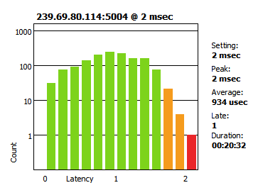

# AES67 Sender
Make a soundcard input available in an AES67 network. Works under Windows (DirectSound, ASIO and WASAPI), Linux (ALSA, JACK, PulseAudio and OSS) and MacOS (CoreAudio and JACK). Tested under Ubuntu (18.04 and 20.04), Raspbian and Windows 10. Not yet tested under MacOS.
## Installation
To install aes67-sender, clone the repository and install the dependencies.
```
git clone https://github.com/philhartung/aes67-sender.git
cd aes67-sender
npm install
```
Audify (audio backend used) prebuilds are available for most major platforms and Node versions. If you need to build Audify from source, see https://github.com/almogh52/audify#requirements-for-source-build.
## Usage
To display the help, execute `node aes67 --help`:
```
Usage: aes67 [options]

Options:
  -V, --version            output the version number
  -v, --verbose            enable verbosity
  --devices                list audio devices
  -d, --device <index>     set audio device
  -m, --mcast <address>    multicast address of AES67 stream
  -n, --streamname <name>  name of AES67 stream
  -c, --channels <number>  number of channels
  -a, --api <api>          audio api (ALSA, OSS, PULSE, JACK, MACOS, ASIO, DS, WASAPI)
  --address <address>      IPv4 address of network interface
  -h, --help               display help for command
```

The software has to be executed with priviliges, because the PTP client binds to ports below 1024.
## Use cases
### Raspberry Pi 4 with Focusrite Scarlett 2i2
The setup is a Rasperry Pi 4 (running Ubuntu 20.04) running *aes67-sender* with a Focusrite Scarlett 2i2 USB audio interface. First list the audio devices:
```
pi@raspberrypi:~/aes67-sender $ node aes67 -a alsa --devices
Selected ALSA as audio api
Index, Name, # of Channels
1 'hw:Scarlett 2i2 USB,0' 2
```
We see the Focusrite interface is index #1, so we can execute the following command to start *aes67-sender*: `sudo node aes67 -a alsa -d 1 -n "Focusrite Scarlett 2i2"`. The device should now show up as "Focusrite Scarlett 2i2" in Dante Controller or similar software. The two inputs of the Focusrite Scarlett 2i2 are now available in the AES67 network.

### Latency cosiderations
In practice low latency is important. Especially when working in a hybrid Dante/AES67 network, latency should be under 2ms. Dante devices are fixed to a maximum of 2ms latency and drop packets with higher latency. With a Raspberry Pi, latency jitter is quite high. A lot/too many packets are dropped because latency is too high when sending audio to a Dante receiver. With a i7-2600 test system (running Ubuntu 18.04), latency (jitter) was low enough for Dante devices. Here is a screenshot of the latency distribution over one hour from *aes67-sender* running on a i7-2600 test system to a Dante receiver:


