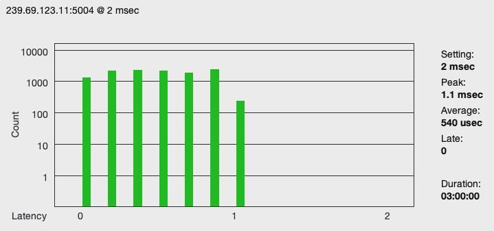
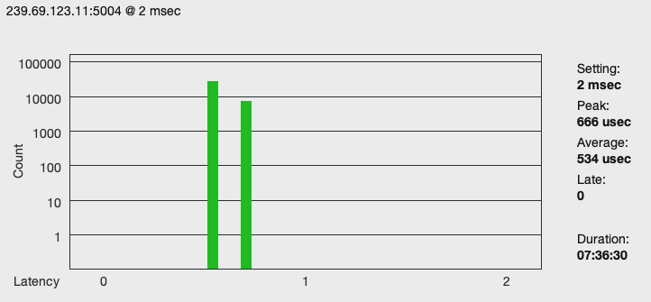
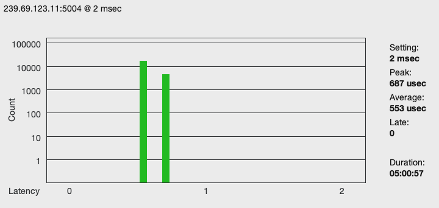
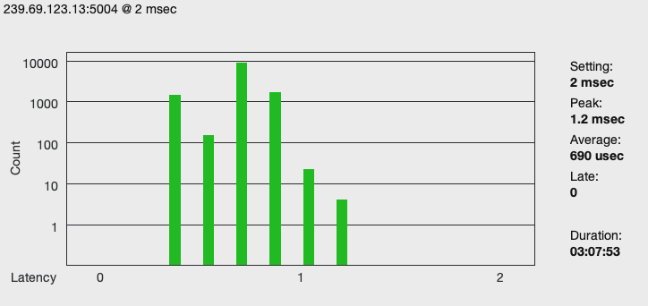

# AES67 Sender

> ⚠️ **Warning:** This version of AES67 Sender is a complete rewrite in Python instead of Javascript. PTP is only supported on Linux and relies on Linux PTP for synchronization. It is currently under development and not yet feature equivalent to the Javascript version.

## Usage on Raspberry Pi 4 and 5
The Raspberry Pi 5 has PTP Hardware Timestamping support, which makes it especially interesting for Audio over IP applications. This software will also work on the Raspberry Pi 4. Because the Raspberry Pi 4 does not support PTP Hardware Timestamping and has a less powerful CPU, the rtp timestamp accuracy on the Pi 4 is not as good as on the Pi 5.

### Installation
This guide is written for the Raspberry Pi running Raspbian, but should also be valid for other Debian and Ubuntu systems.

```
sudo apt update
sudo apt upgrade
sudo apt install linuxptp
sudo apt install libgstreamer1.0-dev libgstreamer-plugins-base1.0-dev libgstreamer-plugins-bad1.0-dev gstreamer1.0-plugins-base gstreamer1.0-plugins-good gstreamer1.0-plugins-bad gstreamer1.0-plugins-ugly gstreamer1.0-libav gstreamer1.0-tools gstreamer1.0-x gstreamer1.0-alsa gstreamer1.0-gl gstreamer1.0-gtk3 gstreamer1.0-qt5 gstreamer1.0-pulseaudio python3-gi
git clone https://github.com/philhartung/aes67-sender.git
```

### PTP on Raspberry Pi 4
#### ptp4l Service
`/etc/systemd/system/ptp4l.service`
```
[Unit]
Description=PTP4L Precision Time Protocol Daemon
After=network-online.target
Wants=network-online.target

[Service]
ExecStart=/usr/sbin/ptp4l -i eth0 -m -S
Restart=on-failure
RestartSec=3

[Install]
WantedBy=multi-user.target
```

#### PHC2SYS Service
`/etc/systemd/system/phc2sys.service`
```
[Unit]
Description=PHC2SYS Daemon
After=ptp4l.service
Requires=ptp4l.service

[Service]
ExecStart=/usr/sbin/phc2sys -s CLOCK_REALTIME -c CLOCK_REALTIME -w -m
Restart=on-failure
RestartSec=3

[Install]
WantedBy=multi-user.target
```

### PTP on Raspberry Pi 5
#### ptp4l Service
`/etc/systemd/system/ptp4l.service`
```
[Unit]
Description=PTP4L Precision Time Protocol Daemon
After=network-online.target
Wants=network-online.target

[Service]
ExecStart=/usr/sbin/ptp4l -i eth0 -m
Restart=on-failure
RestartSec=3

[Install]
WantedBy=multi-user.target
```

### AES67 Service
`/etc/systemd/system/aes67.service`
```
[Unit]
Description=AES67 Sender Service
After=ptp4l.service
Requires=ptp4l.service

[Service]
ExecStart=chrt -f 99 /home/philipp/aes67-sender/src/aes67.py
Restart=always
RestartSec=3

[Install]
WantedBy=multi-user.target
```

### Enabling all services
```
sudo systemctl daemon-reload
sudo systemctl enable aes67
sudo systemctl enable ptp4l
sudo systemctl enable phc2sys # only for RPi 4
sudo reboot
```


### Performance Tweaking
```bash
sudo systemctl disable avahi-daemon
sudo systemctl disable wpa_supplicant
sudo systemctl disable bluetooth
sudo systemctl disable triggerhappy
```

## Testing

### Raspberry Pi 5

GStreamer source timing is used, for example using `alsasrc device=hw:0,0 latency-time=1000 buffer-time=1000` or `audiotestsrc is-live=true samplesperbuffer=48 tick-interval=1000000`. No timing correction is done



Timing correction using active waiting.



Timing correction using `time.sleep()` and `sudo chrt -f 99 ./aes67.py`.



### Raspberry Pi 4

Timing correction using `time.sleep()` and `sudo chrt -f 99 ./aes67.py`.



### Summary
In Summary it can be said that with timing correction the accurary on the Raspberry Pi 5 is more than sufficent for Audio over IP applications, also thanks to PTP hardware timestamping using Linux PTP.