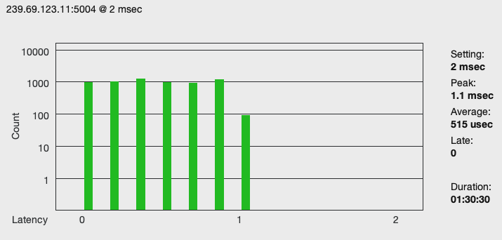

# AES67 Sender
> ⚠️ **Warning:** This version of AES67 Sender is a complete rewrite in Python instead of Javascript. PTP is only supported on Linux and relies on Linux PTP for synchronization. It is currently under development and not yet feature equivalent to the Javascript version.

## Usage on Raspberry Pi 5
The Raspberry Pi 5 has PTP Hardware Timestamping support, which makes it especially interesting for Audio over IP applications. 

### ptp4l Service
`/etc/systemd/system/ptp4l.service`
```
[Unit]
Description=PTP4L Precision Time Protocol Daemon
After=network.target

[Service]
ExecStartPre=/bin/sleep 10
ExecStart=chrt -f 99 /usr/sbin/ptp4l -i eth0 -m
Restart=on-failure

[Install]
WantedBy=multi-user.target
```

### AES67 Service
`/etc/systemd/system/aes67.service`
```
[Unit]
Description=AES67 Sender Service
After=ptp4l.service
Requires=ptp4l.service

[Service]
ExecStartPre=/bin/sleep 5
ExecStart=chrt -f 99 /home/philipp/aes67-sender/aes67.py
Restart=always

[Install]
WantedBy=multi-user.target
```

`sudo systemctl daemon-reload`

### Performance Tweaking
```bash
sudo systemctl disable avahi-daemon
sudo systemctl disable wpa_supplicant
sudo systemctl disable bluetooth
sudo systemctl disable triggerhappy
```

## Testing

### Latency with Raspberry Pi 5

